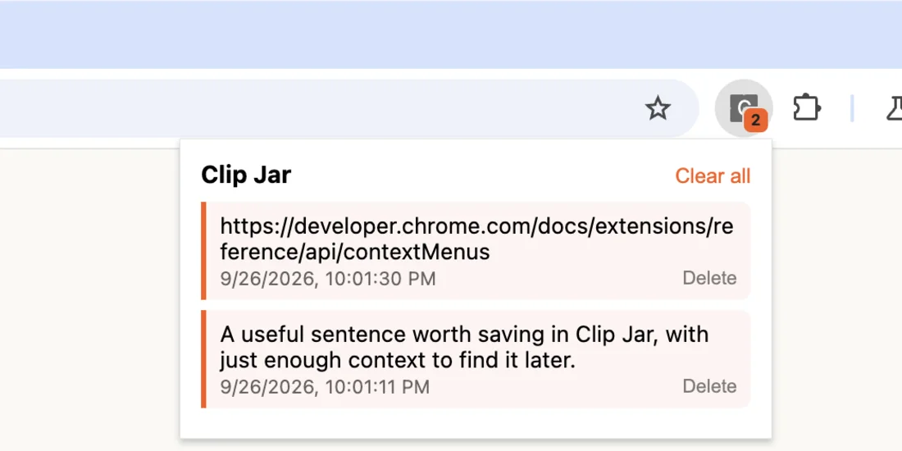

# Clip Jar — save selections and links from Chrome's context menu

Select text or right-click a link, save it in `chrome.storage.local`, then open
the toolbar popup to copy or delete clips. The badge counts saved clips. This is
the exact five-file extension from the [companion tutorial](https://blog.extenshi.io/posts/chrome-extension-context-menu-tutorial/).

## Files

| File | Role |
|---|---|
| `manifest.json` | MV3, `contextMenus` and `storage` permissions, service worker and popup |
| `background.js` | Create menu items on install, save clicked selections or links, update the badge |
| `popup.html` / `popup.css` / `popup.js` | List clips, copy with click or keyboard, delete one or clear all |

## Run it

1. Open `chrome://extensions`, enable **Developer mode**, choose **Load unpacked**, and select this directory.
2. Select text on a web page, right-click, and choose **Save ... to Clip Jar**. Long selections are shortened in the menu label but saved in full.
3. Right-click a link and choose **Save this link to Clip Jar**. When text inside the link is selected, both commands appear in the **Clip Jar** submenu.
4. Open the toolbar popup. Click a clip or focus it and press Enter to copy it. Delete a clip or clear the jar to see the badge update.

The extension requests `contextMenus` and `storage`, with no host access or content scripts. Neither API permission currently adds a Chrome install warning. Clips stay in local extension storage; avoid saving secrets.

MIT, like the rest of this repository.
