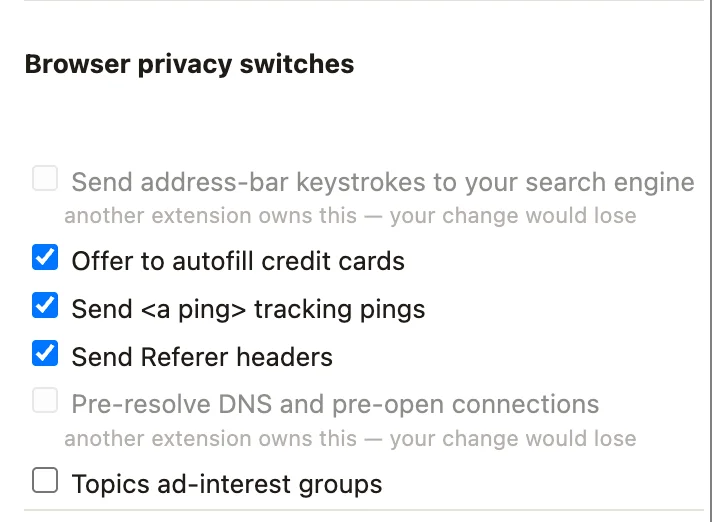

# Clean Slate — a privacy panel that admits what it can't change

A five-file MV3 Chrome extension with three popup panels: clear browsing data
over a time range, toggle Chrome's own privacy switches, and read what the
current site is allowed to do. No service worker, no build step, no dependencies,
no host permissions.



It is the companion sample for the
[blog tutorial on `chrome.privacy` and `levelOfControl`](https://blog.extenshi.io/posts/chrome-privacy-panel-levelofcontrol-browsingdata),
which walks through *why* every line is shaped the way it is.

## The one thing to understand

Chrome's privacy settings are a shared, last-writer-wins pool. Another
extension with higher precedence can hold a setting; enterprise policy can lock
it. Your `set()` call still resolves — the setting just doesn't change. Every
`get()` returns a `levelOfControl` that says so up front:

| `levelOfControl` | Draw a switch? |
|---|---|
| `controllable_by_this_extension` | yes |
| `controlled_by_this_extension` | yes (you already own it) |
| `controlled_by_other_extensions` | no — disabled row, say who wins |
| `not_controllable` | no — disabled row, say it's policy |

So the rule is **`get()` before `set()`**: read the level, then decide whether
a row is a switch or an honest explanation. `browsingData.settings()` carries
the same idea for data types via `dataRemovalPermitted`.

## Files

| File | Role |
|---|---|
| `manifest.json` | MV3; `permissions: ["browsingData", "activeTab"]` (neither warns at install) + `optional_permissions: ["privacy", "contentSettings"]` (the loud ones, asked at the click) |
| `popup.html` | The three panels and their styles |
| `clear.js` | `chrome.browsingData.settings()` pre-fills the checkboxes; `remove()` clears with an explicit `originTypes: { unprotectedWeb: true }` |
| `toggles.js` | `chrome.privacy.*` rows rendered from `levelOfControl`, one-way Privacy Sandbox switches flagged, `onChange` re-renders when control moves |
| `site.js` | `chrome.contentSettings.*.get({ primaryUrl })` for the active tab, read-only on purpose |

## Run it

1. Download this folder (or `git clone` the repo).
2. Open `chrome://extensions`, enable **Developer mode**, click **Load
   unpacked**, pick this folder. The install dialog shows no warning.
3. Open any normal website and click the **Clean Slate** icon. The first
   panel is live; the other two show a **Turn this panel on** button that
   requests its permission right there.

Two things to try: install any other extension that touches `chrome.privacy`
and reopen the popup — the rows it took now say *"another extension owns
this"*. And tick "Topics ad-interest groups" back on after switching it off —
Chrome refuses, and the status line says why.

## Permissions, on the record

`browsingData` and `activeTab` at install (no warning strings). `privacy`
("Change your privacy-related settings") and `contentSettings` ("Change your
settings that control websites' access to features…") are optional and
requested from the click that needs them, so adding them later never
silently disables the extension for existing users. **No host permissions.**

Firefox ports `browsingData` and `privacy` with a different settings menu and
no `scope`; `contentSettings` is Chromium-only — see the tutorial's
cross-browser section.

Before publishing your own privacy panel, run it through the free pre-publish scan:

```bash
npx @extenshi/cli@latest scan ./clean-slate
```

## Credits

Written for the extenshi.io blog; grounded in Google's Apache-2.0
[`api-samples/privacy`](https://github.com/GoogleChrome/chrome-extensions-samples/tree/main/api-samples/privacy),
[`api-samples/browsingData`](https://github.com/GoogleChrome/chrome-extensions-samples/tree/main/api-samples/browsingData)
and [`api-samples/contentSettings`](https://github.com/GoogleChrome/chrome-extensions-samples/tree/main/api-samples/contentSettings)
samples and the official [`chrome.privacy`](https://developer.chrome.com/docs/extensions/reference/api/privacy)
/ [`chrome.browsingData`](https://developer.chrome.com/docs/extensions/reference/api/browsingData)
/ [`chrome.contentSettings`](https://developer.chrome.com/docs/extensions/reference/api/contentSettings)
references. Licensed MIT like the rest of this repository.
