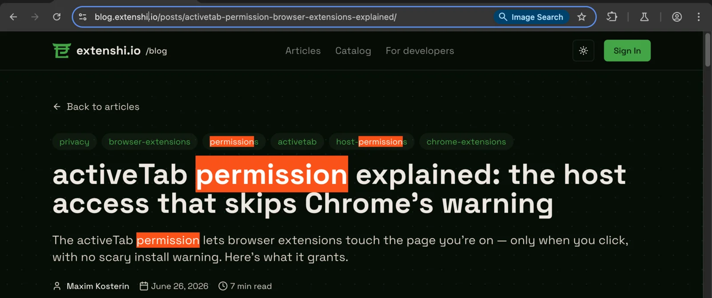

# Marker — act on the current page from Chrome's address bar

Type `mk`, press space, then `hl invoice` to paint every occurrence of a word
on the page you are looking at, `count invoice` to put the number of matches
on the toolbar badge, and `clear` to undo it. Two files, no build step, no
host permissions.



It is the companion sample for the
[blog tutorial on spending the `activeTab` grant from the omnibox](https://blog.extenshi.io/posts/omnibox-activetab-act-on-current-page),
and the sequel to [`chrome-extension-omnibox-keyword-command-palette/`](../chrome-extension-omnibox-keyword-command-palette/)
(Jump), which builds the address-bar launcher this one assumes you have seen.

## The one thing to understand

Accepting an omnibox suggestion is one of the four user gestures Chrome
treats as consent for `activeTab` (the others: running the toolbar action, a
context-menu item, a keyboard shortcut). So the moment the user presses Enter
on your row, the service worker may `scripting.insertCSS()` /
`scripting.executeScript()` into that tab — with no host permission and no
install warning. The grant covers that tab on that origin and is revoked when
the user navigates to another site or closes the tab.

Two things the sample shows that the docs don't spell out:

- A `suggest()` row whose `content` equals what the user has typed is
  **silently dropped** — Chrome treats it as a duplicate of the default
  suggestion. To preview a command, call `setDefaultSuggestion()` from inside
  `onInputChanged` instead, the way Google's `new-tab-search` sample does.
- Highlights are painted with the CSS Custom Highlight API
  (`CSS.highlights` + `::highlight(marker)`), so the page's DOM is never
  modified and `clear` is a one-line registry delete.

## Files

| File | Role |
|---|---|
| `manifest.json` | MV3; `omnibox.keyword: "mk"`, `permissions: ["activeTab", "scripting"]` (neither warns), an empty `action` for the badge |
| `service-worker.js` | Top-level `onInputStarted` / `onInputChanged` / `onInputEntered`; verb parsing, XML-entity escaping, `markInPage()` injected via `executeScript({ func, args })`, badge output |

## Run it

1. Download this folder (or `git clone` the repo).
2. Open `chrome://extensions`, enable **Developer mode**, click **Load
   unpacked**, pick this folder. The install dialog shows no warning.
3. Open any ordinary article. Click into the address bar, type `mk`, press
   **space** — the "Marker" chip appears and the default row lists the verbs.
4. Type `hl the` and press Enter: every "the" turns orange. `mk count the`
   writes the number of matches to the toolbar badge; `mk clear` removes both.
5. Navigate to a different site and try `mk hl` there — that Enter is its own
   gesture, so it works again.

## Permissions, on the record

`activeTab` and `scripting` at install — no warning strings. `action` is a
manifest key, not a permission. **No host permissions.** Chrome's own
`chrome://` pages, the Web Store and the New Tab page refuse injection from
any extension; the sample catches that and writes `!` to the badge.

Firefox grants `activeTab` for omnibox acceptance from Firefox 142 and ships
the Custom Highlight API from Firefox 140; swap `chrome.*` for `browser.*` and
the file ports. Edge follows Chromium unchanged.

Before publishing your own address-bar tool, run it through the free pre-publish scan:

```bash
npx @extenshi/cli@latest scan ./marker
```

## Credits

Written for the extenshi.io blog; grounded in the official
[`activeTab`](https://developer.chrome.com/docs/extensions/develop/concepts/activeTab),
[`chrome.omnibox`](https://developer.chrome.com/docs/extensions/reference/api/omnibox) and
[`chrome.scripting`](https://developer.chrome.com/docs/extensions/reference/api/scripting)
references and Google's Apache-2.0
[`api-samples/omnibox/new-tab-search`](https://github.com/GoogleChrome/chrome-extensions-samples/tree/main/api-samples/omnibox/new-tab-search)
sample. Licensed MIT like the rest of this repository.
