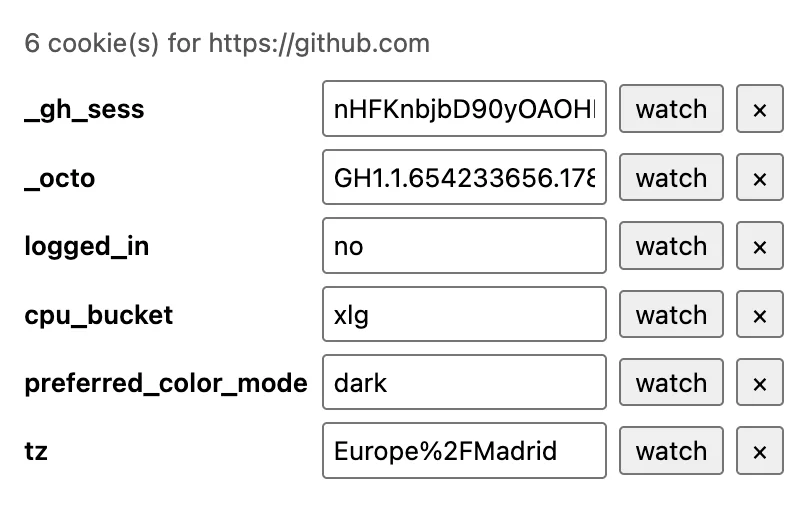

# Cookie Peek — read, write and watch cookies from an MV3 extension

A four-file Chrome extension: a popup that lists every cookie for the site in
the current tab, lets you edit or delete one in place, re-renders live as
cookies change, and a service worker that badges the toolbar icon when a
cookie you're watching disappears. No build step, no dependencies.



It is the companion sample for the
[blog tutorial on `chrome.cookies` in MV3](https://blog.extenshi.io/posts/read-write-watch-cookies-mv3-extension),
which explains line by line *why* the code is shaped the way it is.

## The one thing to understand

`"cookies"` is half a permission. It opens the API and grants access to
exactly zero cookies; `host_permissions` decide what you can *see*. Without
them `getAll()` resolves cleanly with `[]` — no error, no warning — which
looks identical to "this site has no cookies". The tutorial makes you hit
that state on purpose before adding the line that fixes it.

Three more details that bite everyone once:

- **`set()` re-issues the cookie.** Anything you leave out gets a default, not
  the previous value — copy `path`, `secure`, `httpOnly`, `sameSite` and the
  expiry forward, and leave `domain` off host-only cookies or you create a
  second, broader cookie next to the original.
- **Rebuild the URL from the cookie.** Scheme from `secure`, leading dot
  stripped from the domain, and carry `storeId` (load-bearing on Firefox
  container tabs).
- **`"overwrite"` is not a logout.** Updating a cookie fires a removal with
  cause `overwrite` followed by a set; filter it or the watcher cries wolf on
  every token rotation.

## Files

| File | Role |
|---|---|
| `manifest.json` | MV3; `permissions: ["cookies", "tabs", "storage"]`, `host_permissions: ["<all_urls>"]` (the tutorial's final state — see below for the narrower shape) |
| `popup.html` / `popup.js` | Read (`getAll({ url })`), edit (`set`), delete (`remove`), watch, and the `onChanged` live re-render |
| `service-worker.js` | Top-level `onChanged` listener that badges the icon when the watched cookie is removed for a reason other than `overwrite` |

## Run it

1. Download this folder (or `git clone` the repo).
2. Open `chrome://extensions`, enable **Developer mode**, click **Load
   unpacked**, pick this folder.
3. Go to a site you're logged into and click the **Cookie Peek** icon. Edit a
   value and press Tab, delete a throwaway cookie with **×**, or click
   **watch** on a session cookie, close the popup and log out — the icon
   picks up a `!`.

## Permissions, on the record

`cookies` (no install warning on its own), `tabs` (the active tab's URL),
`storage`, and `<all_urls>` — the last one is the expensive line, and the
only one that produces a warning. The tutorial's "Before you publish"
section swaps it for `optional_host_permissions` plus a per-origin
`chrome.permissions.request()` from the popup, so the user grants exactly
the site they were looking at.

Ports to Firefox as `browser.cookies` with the same surface; `storeId`
matters there because of container tabs. Chrome-side, cookies set with the
`Partitioned` attribute (CHIPS) need an explicit `partitionKey` to show up.

Before publishing your own cookie tool, run it through the free pre-publish scan:

```bash
npx @extenshi/cli@latest scan ./cookie-peek
```

## Credits

Written for the extenshi.io blog; grounded in Google's Apache-2.0
[`api-samples/cookies/cookie-clearer`](https://github.com/GoogleChrome/chrome-extensions-samples/tree/main/api-samples/cookies/cookie-clearer)
sample and the official [`chrome.cookies`](https://developer.chrome.com/docs/extensions/reference/api/cookies)
reference. Licensed MIT like the rest of this repository.
