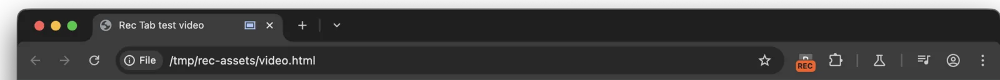

# Rec Tab — record the current tab from an MV3 extension

A minimal, working Chrome extension that records the **current tab's video and
audio** to a `.webm` file. Click the toolbar icon to start; click again to stop
and save. Four files, no build step, no dependencies, no host permissions.



It is the companion sample for the
[blog tutorial on `chrome.tabCapture` + offscreen documents](https://blog.extenshi.io/posts/record-current-tab-tabcapture-offscreen-mv3),
which explains line by line *why* the code is shaped the way it is.

## The one thing to understand

A Manifest V3 service worker has no `navigator.mediaDevices`, no
`MediaRecorder`, and no way to hold a live `MediaStream` — Chrome tears the
worker down when it goes idle. So `chrome.tabCapture.getMediaStreamId()`
returns an opaque **string**, and that string is handed to an **offscreen
document** — a hidden page with a DOM, which stays alive while it's open. The
worker moves the string; the document does the media. That hand-off is the
whole architecture:

```
toolbar click ──▶ service worker ──▶ chrome.tabCapture.getMediaStreamId()
                       │                    (single-use, expires in seconds)
                       ▼
             chrome.runtime.sendMessage({ type: "start-recording", data: streamId })
                       ▼
              offscreen document ──▶ getUserMedia({ chromeMediaSource: "tab", … })
                       │                   + MediaRecorder
                       ▼
        blob URL ──▶ chrome.runtime.sendMessage ──▶ worker ──▶ chrome.downloads
```

Three details that bite everyone once:

- **Get the stream ID last.** It's single-use and expires within seconds; every
  `await` before consuming it is a chance to waste it.
- **Capturing a tab mutes it.** The three lines of `AudioContext` in
  `offscreen.js` route the captured audio back to the speakers — leave them out
  and your user sits in silence while the recording comes out fine.
- **Blob URLs die with their document.** The worker waits for the download to
  report `complete` before closing the offscreen document; close early and you
  ship a truncated `.webm`.

## Files

| File | Role |
|---|---|
| `manifest.json` | MV3; permissions `tabCapture`, `offscreen`, `downloads`; `minimum_chrome_version: "116"` (the stream-ID hand-off into offscreen documents only works from 116) |
| `service-worker.js` | The orchestrator: catches the toolbar click, creates/reuses the offscreen document, gets the stream ID, saves the file. No media code. |
| `offscreen.html` / `offscreen.js` | The hidden page where `getUserMedia` + `MediaRecorder` actually live; keeps its one bit of state in `location.hash` so it survives worker restarts |

## Run it

1. Download this folder (or `git clone` the repo).
2. Open `chrome://extensions`, enable **Developer mode**, click **Load
   unpacked**, pick this folder.
3. Open any normal page playing audio, click the **Rec Tab** icon — the badge
   turns to **REC** — then click again. A `tab-recording-<timestamp>.webm`
   lands in your downloads.

`chrome://` pages, the Chrome Web Store, and the PDF viewer can't be captured.
On Chrome 115 or older the extension installs but silently can't record — that
browser lacks the offscreen hand-off, which is what
`minimum_chrome_version` declares.

## Permissions, on the record

`tabCapture` (invocation-gated, like `activeTab` — the capture only happens
after the user clicks the extension), `offscreen`, `downloads`. **No host
permissions, no `tabs`, no `<all_urls>`.** Chromium-only: Firefox implements
neither `chrome.tabCapture` streams nor `chrome.offscreen`; see the tutorial's
cross-browser section for the `getDisplayMedia` fallback.

Before publishing your own recorder, run it through the free pre-publish scan:

```bash
npx @extenshi/cli@latest scan ./rec-tab
```

## Credits

Written for the extenshi.io blog; grounded in Google's Apache-2.0
[`sample.tabcapture-recorder`](https://github.com/GoogleChrome/chrome-extensions-samples/tree/main/functional-samples/sample.tabcapture-recorder)
and the official [`chrome.tabCapture`](https://developer.chrome.com/docs/extensions/reference/api/tabCapture)
/ [`chrome.offscreen`](https://developer.chrome.com/docs/extensions/reference/api/offscreen)
references. Licensed MIT like the rest of this repository.
